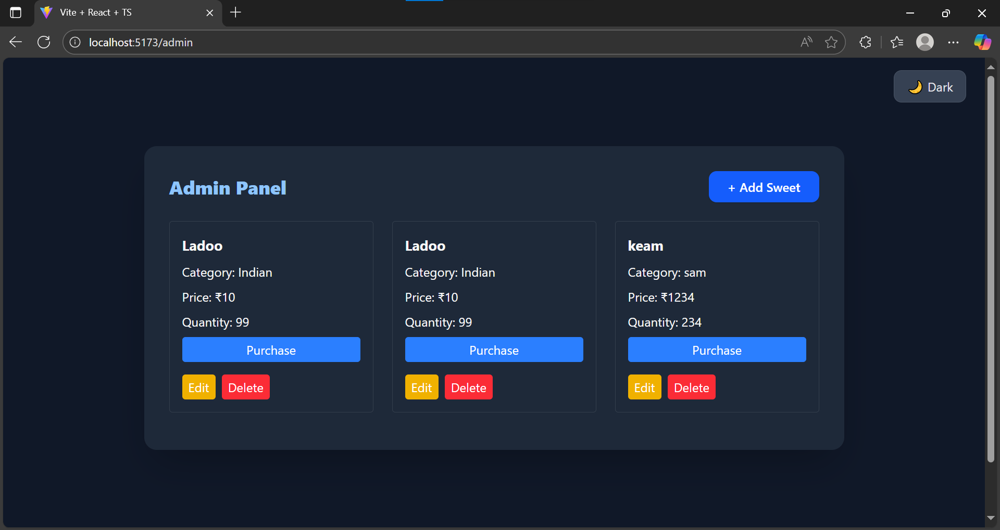
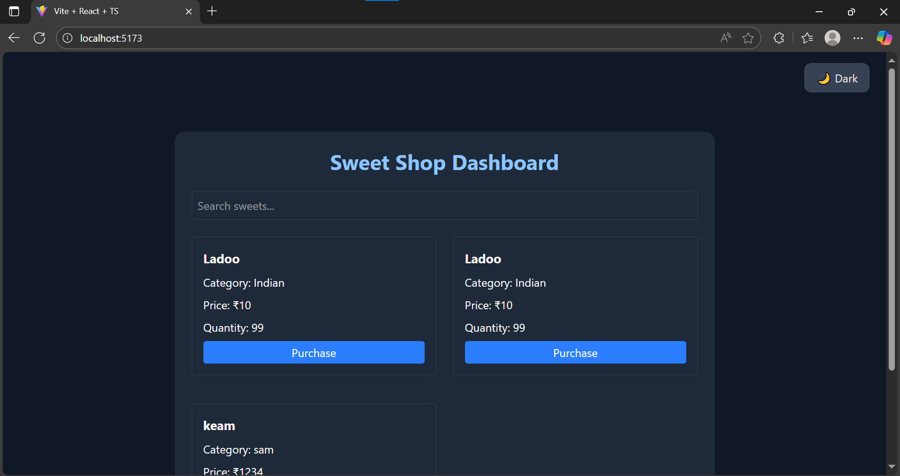

**In contributer you are seeing other contributor because in assignment it is added during ai co author commit add username of ai it was in document shared so idid after i understood not to add them  **
# Sweet Shop Management System

A full-stack application for managing a sweet shop, featuring user authentication, sweet inventory management, and a modern React frontend.

## Project Structure
- **backend/**: Node.js + TypeScript REST API ([see backend/README.md](./backend/README.md))
- **client/**: React + Vite single-page application ([see client/README.md](./client/README.md))

## Setup Instructions
Refer to the respective README files in `backend/` and `client/` for detailed setup, environment configuration, and usage instructions.

## Features
- User registration and login with role selection
- Dashboard to view, search, and purchase sweets
- Admin panel for CRUD management of sweets
- Protected routes and role-based access using JWT
- Responsive, modern UI with central dark mode toggle
- API endpoints centralized in a constants file
- Modals for add/edit forms, grid layouts for sweets

## Screenshots

### Dashboard

### Admin Panel

## AI Usage
- See the [client/README.md](./client/README.md) for details on AI tool usage. Only CSS/UI was generated by AI; all business logic and integration were manual.
- Used GitHub Copilot for architectural guidance (e.g., TDD setup, ES module migration, test isolation).
- Gennerating structure of readme

## Additional Notes
- All important implementation details, architectural decisions, and usage instructions are documented in the respective `backend/README.md` and `client/README.md` files.

